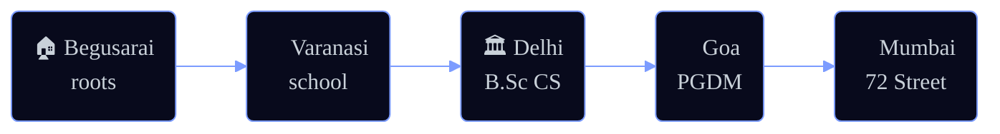

<!--
  ╔══════════════════════════════════════════════════════════════════╗
  ║  cooldudeayush · GitHub profile README                            ║
  ║  Theme: "Stellar Cartographer" — deep-space dark, accent #7C9CFF  ║
  ║  Every widget is custom-themed for a cohesive look.               ║
  ╚══════════════════════════════════════════════════════════════════╝
-->

<!-- ░░░░░░░░░░░░░░░░░░  HEADER BANNER  ░░░░░░░░░░░░░░░░░░ -->
<div align="center">


<!-- ░░░░░░░░░░░░░░░░░░  TYPING TAGLINE  ░░░░░░░░░░░░░░░░░░ -->
<a href="https://github.com/cooldudeayush">
  
</a>

<!-- ░░░░░░░░░░░░░░░░░░  SOCIAL BADGES  ░░░░░░░░░░░░░░░░░░ -->
<p>
  <a href="https://www.linkedin.com/in/ayush-ranjan-24142522b/"></a>
  <a href="mailto:ayush.ranjan@72street.ai"></a>
  <a href="https://www.instagram.com/ayushranjan73/"></a>
  
</p>

</div>

<!-- ░░░░░░░░░░░░░░░░░░  ABOUT  ░░░░░░░░░░░░░░░░░░ -->
## 🛰️ &nbsp; About Me

```python
class AyushRanjan:
    def __init__(self):
        self.role      = "AI Generalist Intern @ 72 Street (fintech · Mumbai)"
        self.studying  = "PGDM Big Data Analytics @ Goa Institute of Management, GIM ('25–'27)"
        self.degree    = "B.Sc (Hons) Computer Science @ Delhi University · GPA 8.43/10"
        self.prev_role = "Associate Analyst @ Vaco Binary Semantics ('24–'25)"
        self.focus     = ["Agentic AI", "RAG systems", "Explainable ML for finance"]
        self.off_screen = ["♟️ chess", "🏏 cricket", "🎨 painting"]

    def current_mission(self):
        return "Shipping RAG & agentic AI from notebook → production."
```

- 🧠 &nbsp;I build **end-to-end** — from LightGBM risk models to dual-LLM agents with vector + graph memory.
- 🔭 &nbsp;Going deep right now on **agentic systems**, **explainable credit ML**, and **local-LLM pipelines**.
- 🤝 &nbsp;Happy to collaborate on applied **AI / ML / Data Science** — reach out anytime.

<!-- ░░░░░░░░░░░░░░░░░░  FEATURED PROJECTS  ░░░░░░░░░░░░░░░░░░ -->
## 🌟 &nbsp; Featured Constellations

<table>
<tr>
<td width="50%" valign="top">

### 🤖 [Customer Care Bot](https://github.com/cooldudeayush/customer_care_bot)
Agentic support bot that **takes real actions** — confirm-gated refunds, hybrid **vector + graph** knowledge, emotional-tone adaptation, cross-session memory, and graceful human handoff. Dual-provider LLM.

`Gemini` · `Claude Haiku` · `FastAPI` · `Next.js` · `RAG`

[**▶ Live Demo**](https://customer-care-bot-ten.vercel.app/)

</td>
<td width="50%" valign="top">

### ✍️ [Air-Draw](https://github.com/cooldudeayush/Air-Draw)
Draw glowing strokes **in the air with your finger** — real-time webcam hand-tracking via MediaPipe Hands, plus a live visualizer of how the AI "sees" your hand. Zero build step.

`MediaPipe` · `Computer Vision` · `Canvas` · `Vanilla JS`

[**▶ Live Demo**](https://air-draw-six.vercel.app/)

</td>
</tr>
<tr>
<td width="50%" valign="top">

### 💳 [Intelli-Credit](https://github.com/cooldudeayush/Intelli-credit)
**Explainable** corporate-credit appraisal for Indian lending — transparent scoring, reconciliation, local RAG, hybrid recommendations, and auto **CAM generation**.

`Explainable ML` · `RAG` · `FinTech` · `Python`

</td>
<td width="50%" valign="top">

### 📈 [Bankruptcy Prediction](https://github.com/cooldudeayush/bankruptcy-prediction-model)
Imbalanced-class bankruptcy risk model — tuned **LightGBM** with `scale_pos_weight` to handle a heavily skewed dataset.

`LightGBM` · `Imbalanced Data` · `Jupyter`

</td>
</tr>
</table>

<details>
<summary><b>🔭 &nbsp;4 more projects — COVID forecasting · skill-gap analyzer · SEO generator · AI interview-sim</b></summary>
<br/>

| Project | What it does | Stack |
| :-- | :-- | :-- |
| [**Epidemic-spread-prediction**](https://github.com/cooldudeayush/Epidemic-spread-prediction) | COVID-19 7-day case forecasting + outbreak risk map across 201 countries | `scikit-learn` `Streamlit` `Plotly` |
| [**future-fit_AI**](https://github.com/cooldudeayush/future-fit_AI) | Privacy-first AI skill-gap analyzer — local LLMs, explainable readiness score, PDF report | `FastAPI` `Ollama` `ChromaDB` `RAG` |
| [**blog_optimiser**](https://github.com/cooldudeayush/blog_optimiser) | Local AI SEO blog generator with competitor retrieval + lightweight RAG | `FastAPI` `React` `TinyLlama` `DuckDuckGo` |
| [**Recruit_ai**](https://github.com/cooldudeayush/Recruit_ai) | AI-powered enterprise interview simulation · *Hack & Forge 2026* | `React` `Vite` `Ollama` |

</details>

<!-- ░░░░░░░░░░░░░░░░░░  JOURNEY  ░░░░░░░░░░░░░░░░░░ -->
## 🗺️ &nbsp; My Cartography — A Journey Across India

> Every star on my map is a place that shaped how I build.



<!-- ░░░░░░░░░░░░░░░░░░  TECH ARSENAL  ░░░░░░░░░░░░░░░░░░ -->
## 🧰 &nbsp; Tech Arsenal

<table>
<tr>
<td valign="top" width="50%">

**Languages & Core**
<br/>


**ML · Data Science**
<br/>


</td>
<td valign="top" width="50%">

**Web & APIs**
<br/>


**Tooling & Cloud**
<br/>


</td>
</tr>
</table>

**GenAI · LLM**
<br/>


**Data · Analytics**
<br/>


<!-- ░░░░░░░░░░░░░░░░░░  GITHUB STATS  ░░░░░░░░░░░░░░░░░░ -->
## 📊 &nbsp; By the Numbers

<div align="center">


<br/>


</div>

<!-- ░░░░░░░░░░░░░░░░░░  SNAKE  ░░░░░░░░░░░░░░░░░░ -->
## 🐍 &nbsp; Watch the Snake Eat My Commits

<div align="center">

<picture>
  <source media="(prefers-color-scheme: dark)" srcset="https://raw.githubusercontent.com/cooldudeayush/cooldudeayush/output/github-snake-dark.svg" />
  <source media="(prefers-color-scheme: light)" srcset="https://raw.githubusercontent.com/cooldudeayush/cooldudeayush/output/github-snake.svg" />
  
</picture>

</div>

<!-- ░░░░░░░░░░░░░░░░░░  FOOTER  ░░░░░░░░░░░░░░░░░░ -->
<div align="center">

### ⭐ &nbsp; *"Substance first — flash as the hook."*


<sub>Charting the cosmos, one commit at a time. · Built with the same care as my portfolio.</sub>

</div>
